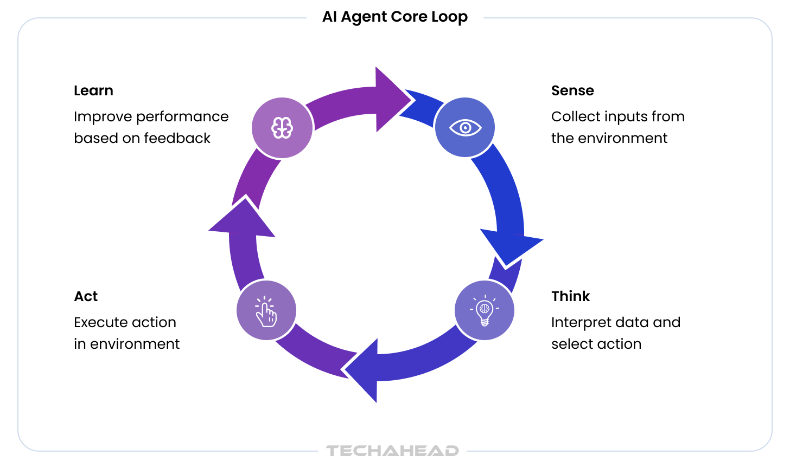
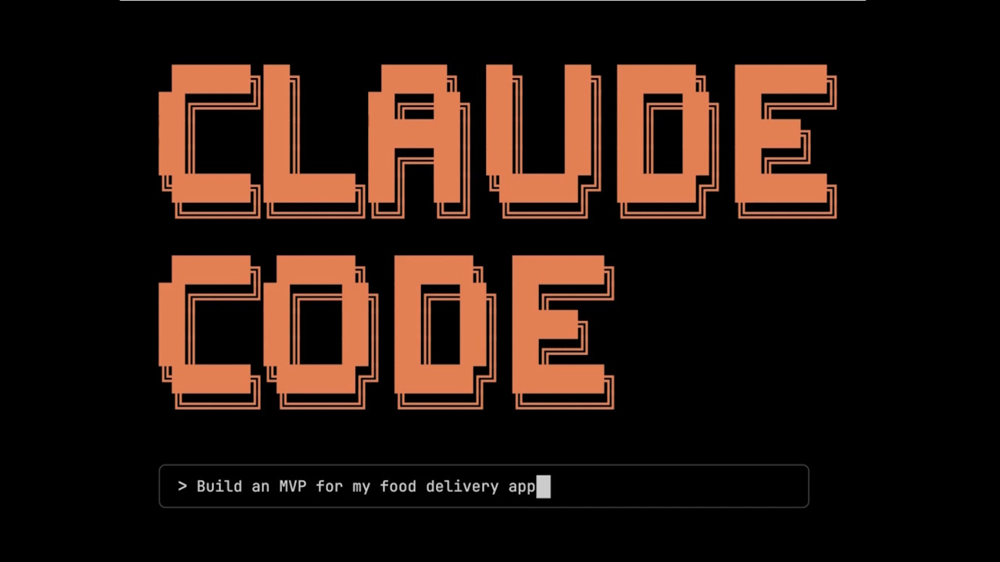
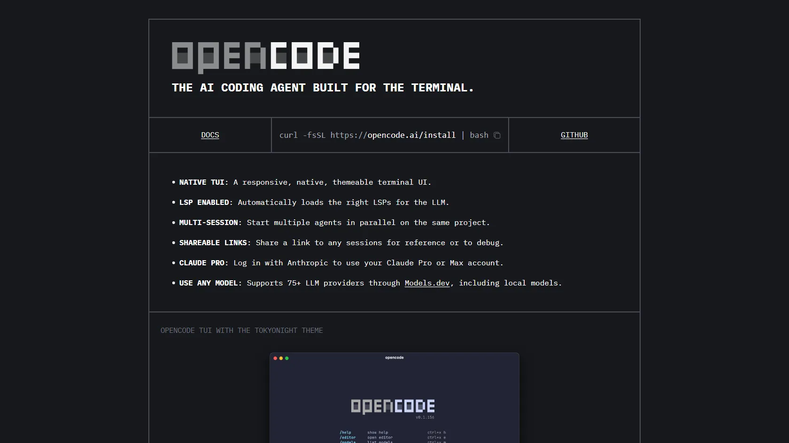
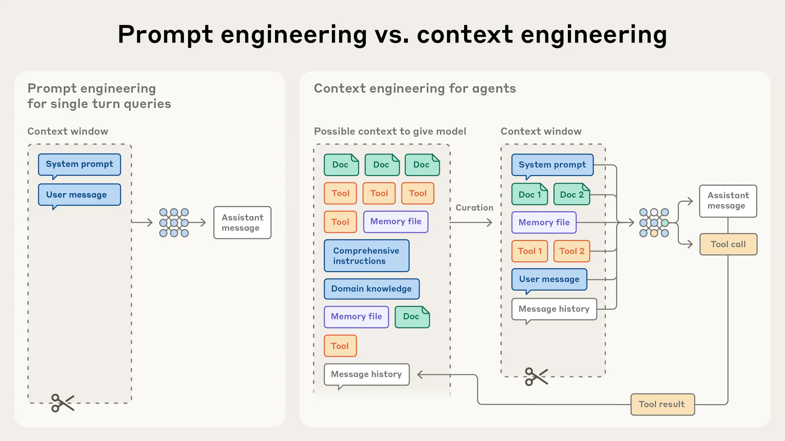
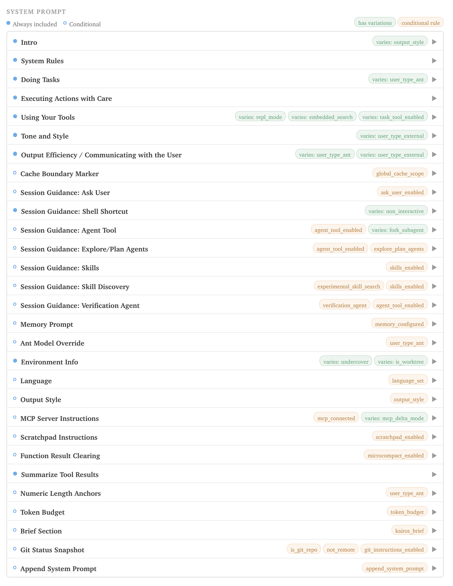

# Context Engineering

#### Thisworkz, Agentic Engineering Session

Tim de Klijn, Willem Bressens

07-05-2026

---

### Question:
## Are you in control of your context?

---

## Definitions

So we speak the same language

--

### Agentic Loop


<small>https://www.techaheadcorp.com/blog/understanding-the-agent-loop/</small>

--

### Context

Everything the model can see: system prompt, conversation history, tool results, files.

--

### Agent Harness

The runtime that drives the agentic loop: Claude Code, Codex CLI, OpenCode, Cursor, etc.

<div style="display:flex; justify-content:center; align-items:center; gap:2rem; width:100%;">
  
  
</div>

--

### Context Engineering



<small>https://www.anthropic.com/engineering/effective-context-engineering-for-ai-agents</small>

--

## Why?

- Garbage in, garbage out
- Focussed context will improve output
- Token limits force trade-offs: what to include, what to leave out
- Reproducibility: same context → consistent results

---

## Memory


--

## Short Term Memory

Everything that lives inside your session.

--

## Long Term Memory

Everything that outlives a session:

- Markdown files: decisions, architecture, todo's
- vector/graph DB's

---

## Do you know what your harness adds to you context?

System prompt, tool calls?

--



--

System promts + additional context might differ between version

---

## Compacting

Summarize or truncate (parts of) the context to extend session

--

## When?

Opencode:

- **auto:** Automatically compact the session when context is full **(default: true)**.
- **prune:** Remove old tool outputs to save tokens **(default: true)**.
- **reserved:** Token buffer for compaction. Leaves enough window to avoid overflow during compaction

---

### Token Cache

Reuse of previously computed KV-cache entries to avoid re-processing unchanged prefix tokens.

--

## What get's cached?

- System prompt: Usually the best candidate for caching. It’s static, long, and repeated across every turn.
- Conversation history: Can be cached up to the most recent exchange.
- New user input: Never cached — it’s the dynamic part that changes each request.

<small>https://www.mindstudio.ai/blog/anthropic-prompt-caching-claude-subscription-limits</small>

---

## Skills

<small>In `~/.claude/skills/explain-code/SKILL.md`:</small>

```md
-​--
description: Explains code with visual diagrams and analogies. Use when explaining how code works, teaching about a codebase, or when the user asks "how does this work?"
-​--

When explaining code, always include:

1. **Start with an analogy**: Compare the code to something from everyday life
2. **Draw a diagram**: Use ASCII art to show the flow, structure, or relationships
3. **Walk through the code**: Explain step-by-step what happens
4. **Highlight a gotcha**: What's a common mistake or misconception?

Keep explanations conversational. For complex concepts, use multiple analogies.
```

<small>https://code.claude.com/docs/en/skills</small>

---

## MCP

> Connect a server when you find yourself copying data into chat from another tool, like an issue tracker or a monitoring dashboard. Once connected, Claude can read and act on that system directly instead of working from what you paste.

<small>https://code.claude.com/docs/en/mcp</small>

---

## Skills vs MCP?

**Skills** — shape *how* the agent behaves. Reusable prompt snippets in your config. Zero setup.

**MCP** — shape *what* the agent can access. Structured, typed tools with auth handled server-side. Shareable across your team.

> You *can* wrap a CLI in a skill — but the agent is guessing at flags.
> MCP gives it an explicit contract.

---

## Review your context

opencode:

``` sh
/export
```

---

## Sub Agents

Demo

---

## Cave Man Speak

> ...the caveman approach treats LLM output as a "lossy compression" problem, where the core information is preserved while the "filler" is discarded...

<small>Someone on LinkedIn</small>
---

## Are you in control of your context?


---

## Thank You

### Questions?